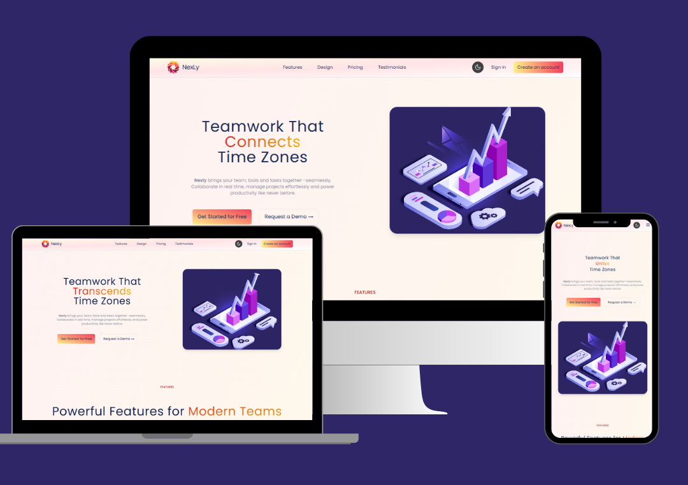

# NexLy – Team Collaboration Landing Page 🚀

**NexLy** is a modern, responsive and animated landing page for a fictional team collaboration SaaS product. It features dynamic elements, smooth transitions using GSAP and a toggleable dark/light theme for a delightful user experience.

[Click here to view the live site](https://nexlylandingpage.vercel.app/)

---

## 📸 Screenshots



---

## ✨ Features

- 🌗 **Dark & Light Theme Toggle**
- 🎥 **Animated Hero Section with Video Background**
- 🧠 **GSAP Scroll Animations**
- 📱 **Fully Responsive Design**
- 📌 **Sticky Navbar with Scroll Links**
- 💡 **Modular React Components**

---

## 📝 Built With

- **React.js**
- **Tailwind CSS**
- **GSAP (GreenSock Animation Platform)**
- **Vite**
- **Lucide Icons**

---

## 📁 Folder Structure

```
NexLy-landing_page/
│
├── public/
├── src/
│   ├── assets/               # Images, video, logo
│   ├── components/           # All React components (Navbar, HeroSection, etc.)
│   ├── animations/           # GSAP animation logic
│   ├── constants/            # Content for the project
│   ├── App.jsx
│   ├── main.jsx
│
├── tailwind.config.js
├── index.css
├── README.md
└── ...
```

---

## 🚀 Getting Started

Clone and run locally:

```bash
git clone https://github.com/HariPriya-hub01/NexLy-Landing_page.git
cd NexLy-Landing_page
npm install
npm run dev
```

---


## 🧠 Inspiration

The project draws inspiration from productivity tools like Slack, Notion and ClickUp, aiming to showcase how sleek UI/UX and clean animations can make even a fictional brand look premium.

---

## 🙌 Acknowledgments

- [GSAP Docs](https://greensock.com/docs/)
- [Tailwind CSS](https://tailwindcss.com/)
- [Lucide Icons](https://lucide.dev/)

---

## 📝 License

This project is licensed under the MIT License - feel free to use and modify it for your own purposes!

---

## 🤝 Connect with Me

[GitHub](https://github.com/HariPriya-hub01) . [LinkedIn](https://www.linkedin.com/in/haripriyaradhakrishnan/)

---

*Crafted with passion 💻✨*
